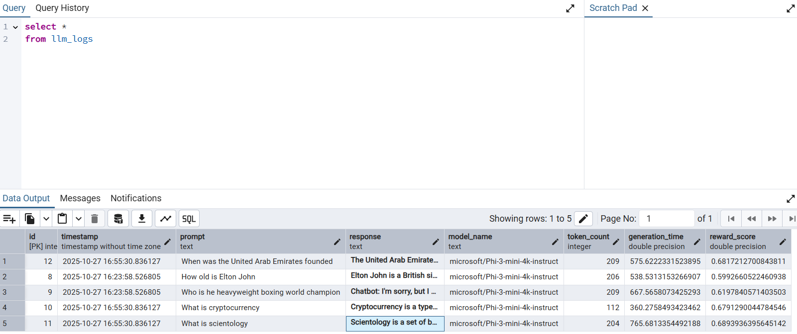

# LLM-RLHF-Logging-DB

### Automating Reward Scoring and Data Logging for Reinforcement Learning from Human Feedback (RLHF)

---

## Overview

**LLM-RLHF-Logging-DB** is a **Python-based project** that logs prompts and responses from large language models (LLMs) into a PostgreSQL database while calculating key metrics like **token counts**, **generation times**, and **reward scores**.

The goal of this project is to explore **automating the reward signal process used in RLHF**, potentially reducing the need for human annotators. By leveraging automated metrics such as **semantic similarity**, **factuality**, and **relevance**, this system evaluates LLM responses to generate structured datasets suitable for RLHF fine-tuning.

---

##  Why This Project

- Traditional RLHF pipelines depend heavily on **manual human feedback**.  
- This project tests whether **automated scoring methods** can produce high-quality reward signals.  
- The result is a **scalable, self-improving feedback loop** where LLMs can be evaluated and fine-tuned automatically.  
- Demonstrates hands-on skills with **transformer-based LLMs, RLHF data workflows, database design, and applied AI engineering**.  

---

## Features

- Logs prompts, responses, and metrics (**token count**, **generation time**) to PostgreSQL  
- Computes **automated reward scores** using semantic similarity and NLP metrics  
- Supports **batch processing** of multiple prompts  
- Tracks model configuration and metadata for auditability  
- Generates **RLHF-ready datasets** for fine-tuning or evaluation  

---

## Project Architecture

### prompt_response_db.py

- Sends prompts to LLM  
- Generates responses  
- Logs data to PostgreSQL  
- Captures metrics: **token_count**, **generation_time**  

### prompt_reqrd_RLHF.py

- Fetches logged responses  
- Embeds prompt/response pairs using **SentenceTransformers**  
- Calculates **semantic similarity** between prompt references and LLM responses using `util.cos_sim`  
- Updates **reward_score** in the database  

> **Note:** The `reward_score` is an automated RLHF signal computed as a **cosine similarity** between embeddings generated by the SentenceTransformers library. This helps evaluate the quality and relevance of LLM responses without manual annotation.

### Database Table: llm_logs

CREATE TABLE llm_logs (
    id SERIAL PRIMARY KEY,
    prompt TEXT,
    response TEXT,
    model_name TEXT,
    token_count INT,
    generation_time FLOAT,
    reward_score FLOAT
);

---

## Columns Description

- **prompt** – The input question or instruction  
- **response** – The model-generated output  
- **model_name** – Name of the model used (e.g., microsoft/Phi-3-mini-4k-instruct)  
- **token_count** – Total tokens used (input + output)  
- **generation_time** – Time taken for generation (seconds)  
- **reward_score** – Semantic similarity score (automated RLHF signal)  

---

## Requirements

- **Python 3.10+**  
- **PostgreSQL instance**  
- Python libraries:

**pip install psycopg2-binary transformers sentence-transformers torch**

---

## Usage

- **Run the Logger:**

python llm_logger.py

- **Run the Reward Scorer:**

python prompt_reward_RLHF.py

- **View Results in PostgreSQL:**

SELECT * FROM llm_logs ORDER BY id DESC;

---

## Future Improvements

- Add additional reward metrics (**factuality, coherence, style**)  
- Integrate multiple LLM models for comparative analysis  
- Build a **dashboard** to visualize performance trends over time  
- Extend to distributed processing for large-scale prompt evaluation

## Project Learnings

- The **automated reward scoring** using semantic similarity provides a quick evaluation of LLM responses but **did not perform as accurately** as expected in all cases.  
- There were instances where the LLM output was relevant and correct, but the similarity score was low due to phrasing differences.  
- **Human-in-the-loop evaluation** and professional data annotators are still recommended for high-quality RLHF datasets.  
- This project demonstrates how automated metrics can **complement human evaluation**, potentially reducing workload but not fully replacing human oversight.
